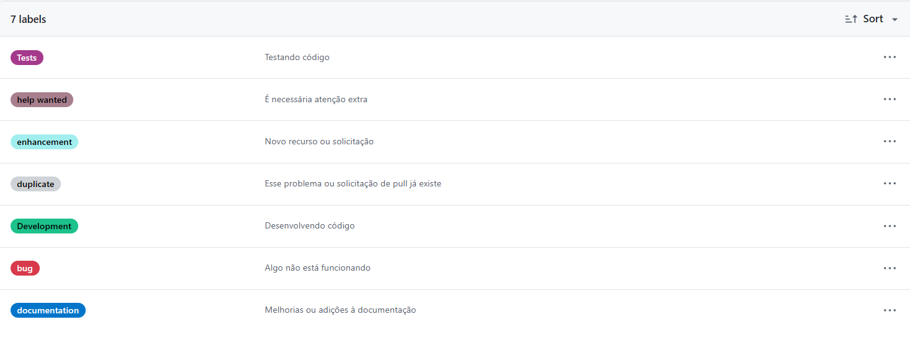
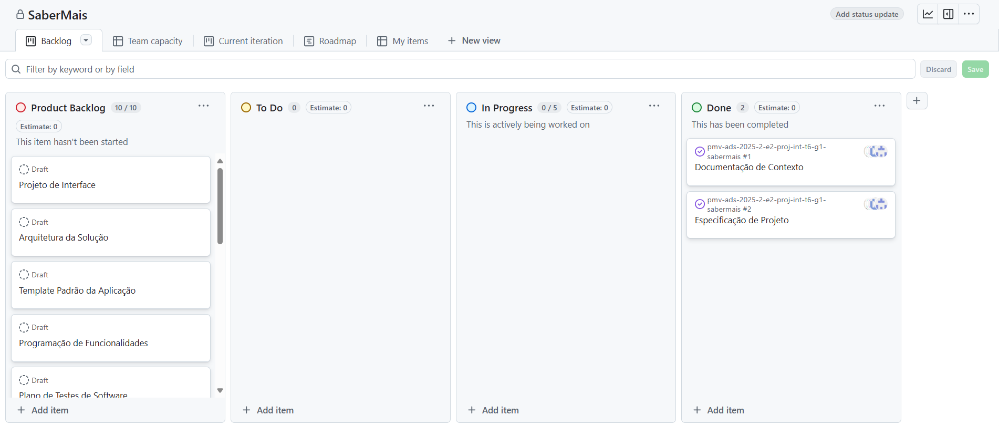

# Metodologia

Pré-requisitos: <a href="2-Especificação do Projeto.md"> Documentação de Especificação</a>

## Gerenciamento de Projeto
A metodologia ágil escolhida para o desenvolvimento deste projeto foi o SCRUM, pois como citam Amaral, Fleury e Isoni (2019, p. 68), seus benefícios são a

“visão clara dos resultados a entregar; ritmo e disciplina necessários à execução; definição de papéis e responsabilidades dos integrantes do projeto (Scrum Owner, Scrum Master e Team); empoderamento dos membros da equipe de projetos para atingir o desafio; conhecimento distribuído e compartilhado de forma colaborativa; ambiência favorável para crítica às ideias e não às pessoas.”

## Controle de Versão

A ferramenta de controle de versão adotada no projeto foi o
[Git](https://git-scm.com/), sendo que o [Github](https://github.com)
foi utilizado para hospedagem do repositório.

O projeto segue a seguinte convenção para o nome de branches:

- `main`: versão estável já testada do software
- `unstable`: versão já testada do software, porém instável
- `testing`: versão em testes do software
- `dev`: versão de desenvolvimento do software

Quanto à gerência de issues, o projeto adota a seguinte convenção para
etiquetas:

## Gerenciamento de Projeto

### Divisão de Papéis

- Scrum Master: Symon Silva Lima 
- Product Owner: José Ricardo Feitosa Marcelino
- Equipe de Desenvolvimento: Claudia Marcela Pinheiro Maia, José Ricardo Feitosa Marcelino, Kauê Gonçalves Magalhães da Silva, Lucas Reis Esteves, Luiz Gustavo Alcantara Seabra, Symon Silva Lima
- Equipe de Design: Claudia Marcela Pinheiro Maia, Kauê Gonçalves Magalhães da Silva

### Processo

Para organização e distribuição das tarefas do projeto, a equipe está utilizando o GitHub, estruturado com as seguintes listas:

Product Backlog: recebe as tarefas a serem trabalhadas e representa o Backlog do produto. Todas as atividades identificadas no decorrer do projeto são incorporadas a esta lista.

To Do: esta lista representa o Sprint Backlog que está sendo trabalhado.

In progress: lista das tarefas iniciadas.

Done: nesta lista são colocadas as tarefas finalizadas e as que passaram pelos testes e controle de qualidade, prontas para serem entregues aos usuários.

### Ferramentas

As ferramentas empregadas no projeto são:

Editor de código.

Ferramentas de comunicação.

Ferramentas de desenho de tela (MarvelApp).

O editor de código foi escolhido porque ele possui uma integração com o sistema de versão.

As ferramentas de comunicação utilizadas possuem integração semelhante e por isso foram selecionadas.

Por fim, para criar diagramas utilizamos essa ferramenta por melhor captar as necessidades da nossa solução.

Os artefatos do projeto são desenvolvidos a partir de diversas plataformas e a relação dos ambientes com seu respectivo propósito é apresentada na tabela que se segue.

| AMBIENTE                            | PLATAFORMA                         | LINK DE ACESSO                         |
|-------------------------------------|------------------------------------|----------------------------------------|
| Repositório de código fonte         | GitHub                             | https://github.com/ICEI-PUC-Minas-PMV-ADS/pmv-ads-2025-2-e2-proj-int-t6-g1-sabermais/blob/main/src                          |
| Documentos do projeto               | GitHub                             | https://github.com/ICEI-PUC-Minas-PMV-ADS/pmv-ads-2025-2-e2-proj-int-t6-g1-sabermais/tree/main/docs                            |
| Projeto de Interface                | Marvel App                         | https://marvelapp.com/prototype/34h9gf5g/screen/97852022                          |
| Gerenciamento do Projeto            | GitHub Projects                    | https://github.com/orgs/ICEI-PUC-Minas-PMV-ADS/projects/2312                            |
| Hospedagem                          | SmarterASP.NET                     | [Saber+](http://symonsl7-001-site1.stempurl.com/Cursos)                           |

Credencias para poder acessar a aplicação (Essas crendecias não são funcionalidades da aplicação é somente para poder acessar a hospedagem de teste do SmarterASP.NET, ira abrir uma caixa de diálogo insira as informações abaixo para poder acessar a aplicação. Caso apareça uma tela pedindo para continuar no site, clicar no botão "Continuar no Site")

Usuário: 11277727

Senha: 60-dayfreetrial

### Estratégia de Organização de Codificação 

[codigo-fonte](https://github.com/ICEI-PUC-Minas-PMV-ADS/pmv-ads-2025-2-e2-proj-int-t6-g1-sabermais/blob/main/src)

 
