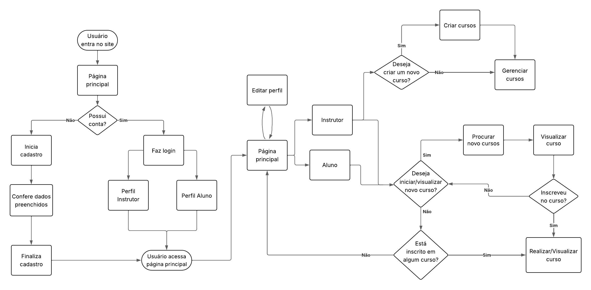
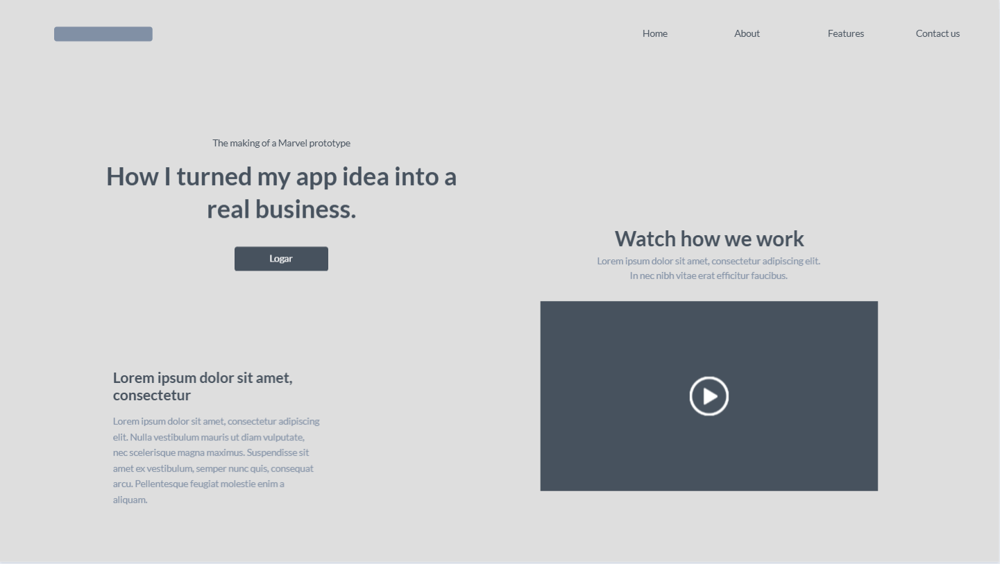
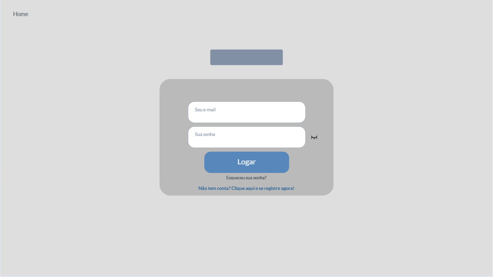
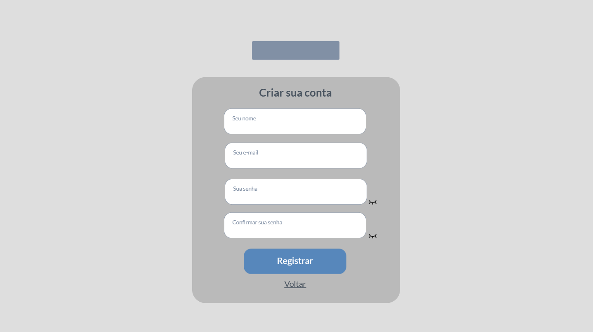
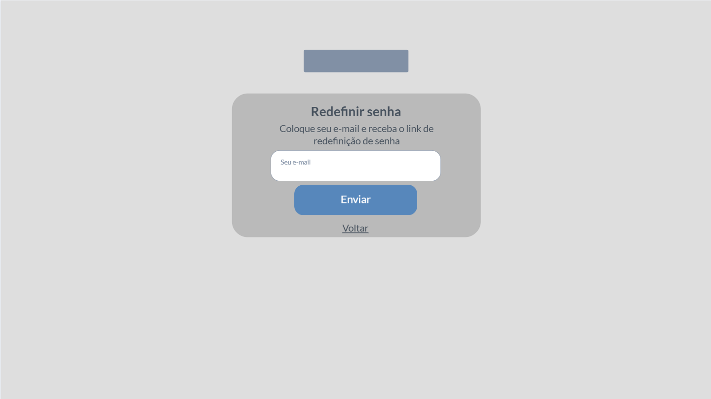
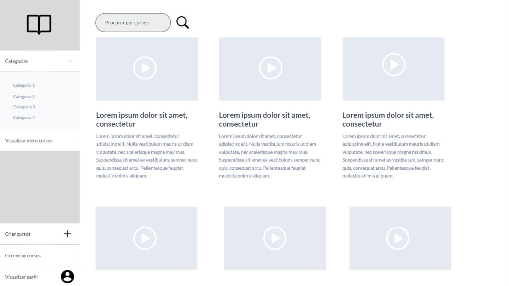
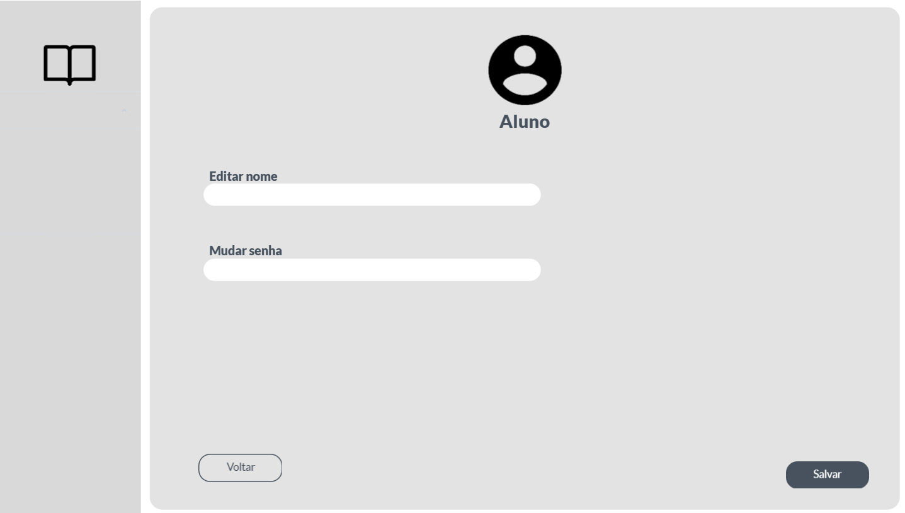
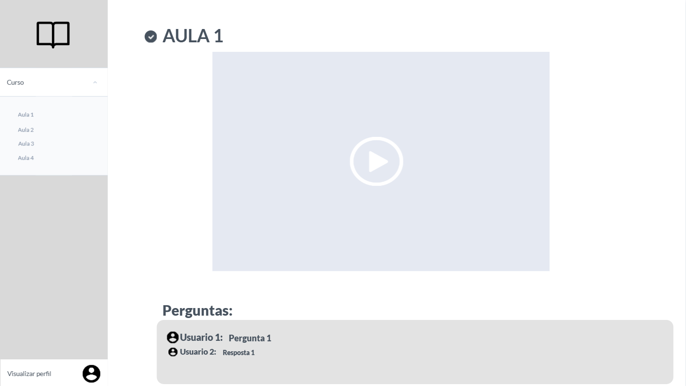
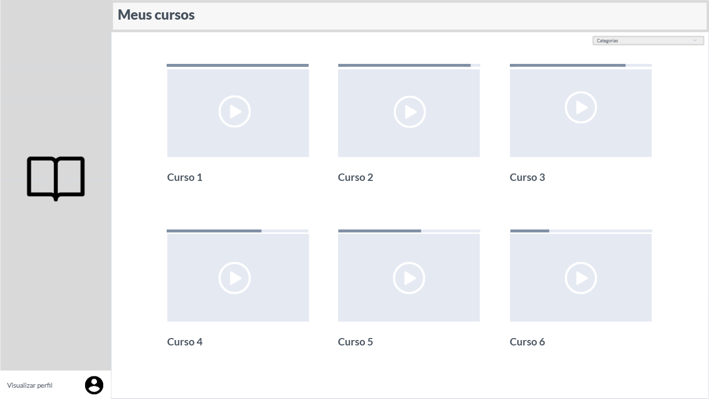
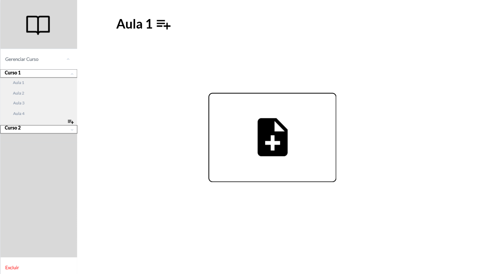

# Projeto de Interface

Pré-requisitos: <a href="02-Especificação do Projeto.md"> Especificação do Projeto</a>

Visão geral da interação do usuário pelas telas do sistema e protótipo interativo das telas com as funcionalidades que fazem parte do sistema (wireframes).

## Diagrama de Fluxo

## Wireframes

- Figura 1 - Tela de LandingPage.

 Tela destinada a gerar conversões, informar o objetivo da plataforma e consequentemente levar ao cadastro.

- Figura 2 - Tela de Login.

 RF-002	O usuário deve poder se autenticar (login).

- Figura 3 - Tela de registro.

 RF-001	O usuário deve poder se cadastrar como “Aluno” ou “Instrutor”.

- Figura 4 - Tela recuperação de senha.

 RF-003	O usuário deve poder recuperar sua senha.

- Figura 5 - Tela da página inicial.

 Tela inicial que apresenta todos os cursos e permite a pesquisa de outros

- Figura 6 - Tela da página de editar perfil.

 RF-004	O usuário deve poder gerenciar seu próprio perfil.

- Figura 7 - Tela da página de curso.

 RF-007	O aluno deve poder assistir às aulas e marcá-las como concluídas.
 
 RF-009	O aluno deve poder fazer perguntas e respostas em cada aula.

- Figura 8 - Tela da página de visualização de cursos.

 RF-005	O aluno deve poder visualizar o painel “Meus Cursos” com seu progresso.
 
 RF-006	O aluno deve poder gereciar os seus cursos.

- Figura 9 - Tela da página de gerenciamento de curso.

 RF-012	O instrutor deve poder gerenciar seus próprios cursos (CRUD).

