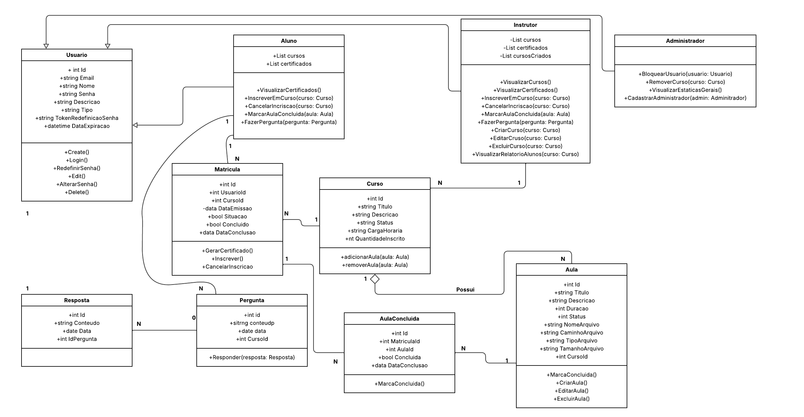
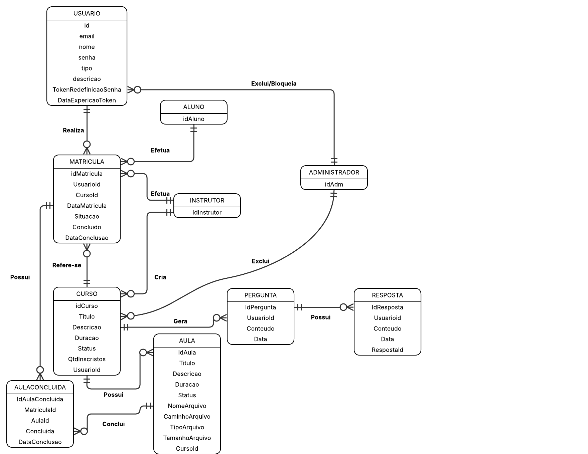

# Arquitetura da Solução

Pré-requisitos: <a href="3-Projeto de Interface.md"> Projeto de Interface</a>

Definição de como o software é estruturado em termos dos componentes que fazem parte da solução e do ambiente de hospedagem da aplicação.

## Diagrama de Classes

## Modelo ER (Projeto Conceitual)

## Projeto da Base de Dados

## Tecnologias Utilizadas

https://lucid.app/ para desenvolimento do Diagrama de Classes, Modelo ER e Projeto da Base de Dados.

C# ASP.NET e Bootstrap para Desenvolvimento da Aplicação.

Banco de Dados SqlServer.

## Hospedagem

Aplicação foi hospedada no SmartASP.NET link para acesso:

[Saber+](http://symonsl7-001-site1.stempurl.com/)

Credencias para poder acessar a aplicação (Essas crendecias não são funcionalidades da aplicação é somente para poder acessar a hospedagem de teste do SmarterASP.NET, ira abrir uma caixa de diálogo insira as informações abaixo para poder acessar a aplicação. Caso apareça uma tela pedindo para continuar no site, clicar no botão "Continuar no Site")

Usuário: 11277727

Senha: 60-dayfreetrial
