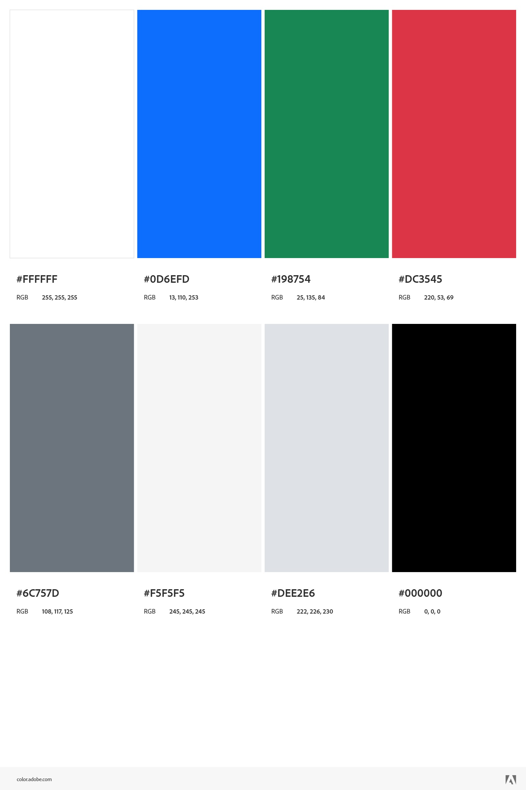

# Apresentação

## Título do Projeto

[Saber+](http://symonsl7-001-site1.stempurl.com/)

Credencias para poder acessar a aplicação (Essas credencias não são funcionalidades da aplicação é somente para poder acessar a hospedagem de teste do SmarterASP.NET, ira abrir uma caixa de diálogo insira as informações abaixo para poder acessar a aplicação. Caso apareça uma tela pedindo para continuar no site, clicar no botão "Continuar no Site")

Usuário: 11277727

Senha: 60-dayfreetrial

## Identidade Visual

### Logo

### Cores 

### Tipografia

A principal vantagem da fonte Consolas é a sua clareza em ambientes de programação. Pois ela contém caracteres monospaçados que garantem o alinhamento vertical, além de possuir um design com distinções claras (como o zero cortado), os quais facilitam a leitura e a depuração de código em qualquer tamanho.

### Slide

[ApresentaçãoSaber+.pptx](https://github.com/user-attachments/files/23689532/ApresentacaoSaber%2B.pptx)

[Vídeo de Apresentação Youtube](https://www.youtube.com/watch?v=LYQeTvTZwPI)

https://github.com/user-attachments/assets/81fd73ce-aa85-4ddb-a9f9-5054e0c79f28

[Vídeo .MP4](https://github.com/ICEI-PUC-Minas-PMV-ADS/pmv-ads-2025-2-e2-proj-int-t6-g1-sabermais/blob/main/presentation/ApresentacaoFinalSaberMais_r3.mp4)
